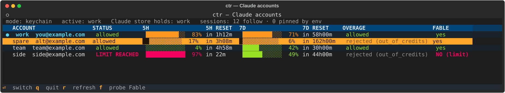

# ctr — claude-token-rotator

Keep several Claude Code tokens in the macOS keychain, watch how much of each
account's 5-hour and 7-day quota is gone, and switch to the one with the most
headroom before the active account runs out.

Built for running many Claude Code sessions at once across more than one Max
subscription. If you only have one account, this does nothing useful for you.

```
$ claude-rotator list
   LABEL   ACCOUNT            PLAN  KIND   ADDED        5H    RESETS    7D    RESETS
*  work    you@example.com    max   oat    2026-09-10   89%  in 42m    27%  in 159h
   spare   alt@example.com    max   oat    2026-09-11    4%  in 3h11m   12%  in 159h

$ claude-rotator switch spare
Switched to 'spare'. Claude Code's credentials store now holds it.
6 running claude session(s) follow it from their next request.
```

`ctr ui` shows the same thing full-screen, btop-style, and switches on Enter.



macOS only. Python 3.8+, standard library only. The optional dashboard needs
[Textual](https://textual.textualize.io) (see [Dashboard](#dashboard-ctr-ui)).

## Switching running sessions

`ctr` has two ways to apply the active token.

**Keychain mode (`ctr switch <alias>`) moves running sessions.** Claude Code
keeps its login in the keychain item `Claude Code-credentials` and re-reads it
before each token-refresh check (with a 30-second read cache) and straight
after any 401. `ctr switch` writes the chosen token into that item, so every
running `claude` that was started *without* `CLAUDE_CODE_OAUTH_TOKEN` moves to
the new account on its next request. There is no restart and no lost context.
Measured on Claude Code 2.1.285 with a logging proxy that fingerprinted the
bearer of every request:

- the prompt sent 35 s after a switch went out on the new account, with that
  account's own rate-limit headers;
- a prompt sent the instant after a switch went out once on the old cached
  token. If that token was already dead, the 401 made Claude re-read the store
  and retry on the new account, so the user saw nothing. If it was still
  valid, the request succeeded on the old account and the move happened within
  30 s;
- a session started with `CLAUDE_CODE_OAUTH_TOKEN` in its environment ignored
  the store completely.

Only the `claudeAiOauth` part of the item changes. Everything else in it
(`mcpOAuth`, your MCP server logins) is written back untouched. If the keychain
cannot be read (locked, timed out), `ctr` writes nothing at all rather than
treating the item as empty. The interactive `/login` it replaces is saved first
as `ctr-login:Claude Code-credentials` and re-captured on every switch, so a
refresh token rotated by a running session is picked up next time. Put it back
with:

```sh
claude-rotator switch --restore-login
```

If you ran `claude /login` since the switch, the store already holds a newer
login. Restore keeps that one and makes it the saved copy, instead of
overwriting it with the older backup. `ctr use` (leaving keychain mode) and
removing the active token also hand the login back. There is one narrow race
left: a session refreshing the `/login` in the same ~100 ms that `ctr switch`
replaces it would lose that rotation, and restore would then need
`claude /login`. `ctr` reads `CLAUDE_CONFIG_DIR` from its own environment to
find the item, so run `ctr` with the same value your `claude` uses (unset by
default).

While a setup-token is in the store, Claude Code only has the
`user:inference` scope, so features that need your full login (claude.ai
connectors, `/usage`) are unavailable until you restore it.

`ctr switch` also counts the running sessions that *won't* follow: those
started with `CLAUDE_CODE_OAUTH_TOKEN` set. It reads them with `ps -E` (your own
processes only) and names which token each one is pinned to, without printing
the token. In keychain mode `active.sh` exports no token and unsets an inherited
one, so every new shell starts sessions that follow.

**Env mode (`ctr use <alias>`, the v1 behaviour)** exports
`CLAUDE_CODE_OAUTH_TOKEN` for new shells and never touches Claude's store. A
running `claude` holds that token in memory, so a session parked on
`Usage limit reached · continuing automatically at 4pm` stays parked after you
switch. The fix is to restart it: `ctr rollover` sends `/exit`, then
`claude --resume <session-id>`, so the conversation survives. It drives
[herdr](https://herdr.dev) panes and does nothing if you don't use herdr.

`ctr next` and the monitor switch in whichever mode you used last.

## Install

```sh
git clone https://github.com/binaryk/claude-token-rotator.git
cd claude-token-rotator
./install.sh
```

That symlinks `ctr` and `claude-rotator` (same binary) into `~/.local/bin`,
creates `~/.config/ctr` with mode 0700, and appends a guarded block to your
`~/.zshrc`:

```sh
# >>> ctr (claude-token-rotator) >>>
if [ -r "$HOME/.config/ctr/active.sh" ]; then . "$HOME/.config/ctr/active.sh"; fi
# <<< ctr (claude-token-rotator) <<<
```

Re-running `install.sh` replaces that block rather than adding a second one. It
backs the file up first, and follows a symlinked `~/.zshrc` to the real file
instead of replacing the link.

The background monitor is not installed by this script. See
[Monitoring](#monitoring).

## Add your tokens

Mint one long-lived token per account with `claude setup-token`. It opens a
browser login, so you have to run it yourself, once per account:

```sh
claude setup-token          # log in as account #1, copy the sk-ant-oat01-... it prints
claude-rotator add work     # prompts for it without echoing

claude setup-token          # log in as account #2
claude-rotator add spare
```

Three input forms:

| form | notes |
|---|---|
| `add <alias>` | prompts with echo off. Use this one. |
| `add <alias> -` or `add <alias> --token -` | reads stdin, for scripts |
| `add <alias> <token>` | works, but the token lands in `ps` and `~/.zsh_history`. `ctr` prints a warning telling you how to clear it. |

`add --from-login` registers whatever token your current interactive
`claude` login already put in the keychain, if you want that account in the
rotation too.

## Daily use

```sh
claude-rotator list             # every token with live usage and reset times
claude-rotator status --json    # same thing, machine readable
claude-rotator next             # switch to whichever token has the most headroom
claude-rotator switch spare     # move Claude's own login; running sessions follow
claude-rotator switch spare --json
claude-rotator use spare        # env mode: new shells only
claude-rotator ui               # full-screen dashboard (alias: top)
claude-rotator rollover         # restart parked sessions on the new token (dry run)
claude-rotator doctor           # check the whole install end to end
```

`rollover` prints what it would do and touches nothing. Add `--apply` to run it
for real, and `--only <pane-id>` to do a single pane while you watch.

## Dashboard (`ctr ui`)


One row per account: status, 5-hour and 7-day bars with reset countdowns,
extra-usage (overage) state, and whether the Fable model still answers.
`↑`/`↓` or `j`/`k` select, `Enter` runs `ctr switch` on the row, `r` refreshes
now, `f` re-probes Fable, `q` quits. Usage refreshes every 60 s
(`--interval`) through the same cache as `ctr status`, so it costs one tiny
request per account per minute.

Fable availability is probed lazily: one `claude -p` on Fable per account,
cached for 30 minutes. It needs the real CLI because a raw API request with a
Fable model returns 429 on every OAuth account whether or not the quota is
spent. The probe hands the token over in the environment, never argv, and runs
with no setting sources and a private config dir, so none of your hooks or
plugins fire.

The dashboard needs Textual. The rest of `ctr` stays standard-library only, and
`ctr ui` tells you what to install when it is missing:

```sh
python3 -m pip install --user 'textual>=0.47'
```

With Textual (or just Rich) installed, `ctr status` in a terminal also prints
coloured bars. Piped output stays the plain table.

## How it picks

Among tokens that are usable, not parked, and below both thresholds, it takes
the lowest 5-hour utilisation, breaking ties on the 7-day number and then on the
alias. It switches when all of these hold:

- the active token crossed `switch_at_5h` (85%) or `switch_at_7d` (95%)
- some other token qualifies
- that token is at least `min_improvement` (10 points) better on the window that
  triggered
- the last switch was more than `min_switch_interval_s` (600) ago

The token it switches away from is parked, and stays parked until its own
readings drop below `recover_below_5h` (60%) and `recover_below_7d` (80%). That
keeps it from bouncing back and forth across a threshold.

**A token that is itself over the threshold is not a refuge.** Switching onto a
token at 99% strands you: the good token is now parked and the new one dies
within minutes. So `ctr` reports "no headroom anywhere" instead.

**Unless the active token is actually dead.** If it comes back `rejected`, any
live token beats it, so the thresholds are dropped for that one decision. A
token with 10% of its hour left is worth having.

**One failed probe is not a signal.** An unauthenticated request to the usage
endpoint returns 429, so a 429 proves nothing about your token. `ctr` needs two
consecutive failures before a probe error can trigger a switch. A measured
`rejected` still fires immediately.

Override any of these in `~/.config/ctr/config.json`:

```json
{
  "switch_at_5h": 85.0,
  "switch_at_7d": 95.0,
  "recover_below_5h": 60.0,
  "recover_below_7d": 80.0,
  "min_improvement": 10.0,
  "min_switch_interval_s": 600,
  "cache_ttl_s": 60,
  "http_timeout_s": 20,
  "auto_rollover": false,
  "auto_switch": true
}
```

`auto_switch` is the on/off switch for automatic rotation (default on). With it
off, the monitor keeps probing and logs "would switch", but never switches.

```sh
ctr auto        # show the state and the thresholds in effect
ctr auto off    # stop automatic switching
ctr auto on     # resume it
```

## Monitoring

```sh
claude-rotator install-monitor          # launchd, every 5 minutes
claude-rotator monitor --once           # one pass, by hand
claude-rotator uninstall-monitor
```

The agent is `com.binarcode.ctr-monitor`, logging to `~/Library/Logs/ctr.log`.
An uneventful tick writes nothing, so a quiet log is the healthy state. Check it
with `launchctl list com.binarcode.ctr-monitor` (`LastExitStatus = 0`) or with
`claude-rotator doctor`.

When it switches, you get a macOS notification and a log line. It will not touch
your running sessions unless you pass `--auto-rollover`, which is off by
default. Watch a manual `rollover` work before you turn that on.

## Where the tokens live

In the macOS keychain, one generic-password item per alias, service name
`ctr:<alias>`:

```sh
security find-generic-password -s "ctr:work" -w
```

Nothing else on disk holds a secret. `~/.config/ctr` has three files, all 0600:

- `tokens.json`: alias, account, plan, date. No token.
- `state.json`: parked tokens, last switch, cached usage percentages.
- `active.sh`: a `security find-generic-password` call, not a value.

`active.sh` reads the keychain each time your shell sources it, so the file is
inert on its own and safe to back up or sync:

```sh
CTR_ACTIVE_LABEL='work'
_ctr_tok="$(security find-generic-password -s 'ctr:work' -w 2>/dev/null || true)"
if [ -n "$_ctr_tok" ]; then export CLAUDE_CODE_OAUTH_TOKEN="$_ctr_tok"; fi
unset _ctr_tok
```

`ctr`'s own tokens never appear in `argv`, so they never show up in `ps`. Writes go in on
stdin: `security add-generic-password ... -w` with no value prompts twice and
reads both from stdin. (Feeding it the secret only once stores an **empty**
password and still exits 0, which is worth knowing if you script `security`
yourself.)

Usage probes send your token and the word "hi" to `api.anthropic.com`. Nothing
goes anywhere else, and no log or config file ever contains more than the first
six characters of a token.

In env mode `ctr` never touches the `Claude Code-credentials` item. In keychain
mode it replaces only `claudeAiOauth` in it, as described in
[Switching running sessions](#switching-running-sessions). That item holds more
than one token, and with a few MCP logins it grows past the 4 KB line limit of
`security -i`. The stdin prompt silently truncates at 128 bytes. So, exactly
like Claude Code does for the same item on every token refresh, `ctr` passes
larger payloads hex-encoded in `argv` for the few milliseconds `security` runs.
That is the only place `ctr` puts secret material in `argv`, and it adds no
exposure Claude Code does not already create.

## How usage is measured

Claude Code reads quota from `GET /api/oauth/usage`. That endpoint needs the
`user:profile` scope, and a `claude setup-token` token does not have it:

```json
{"error": {"type": "permission_error",
  "message": "OAuth token does not meet scope requirement user:profile"}}
```

So for long-lived tokens `ctr` sends a `POST /v1/messages` with
`max_tokens: 0`, which returns 200 with empty content and a full set of
rate-limit headers:

```
anthropic-ratelimit-unified-5h-utilization: 0.51
anthropic-ratelimit-unified-5h-reset: 1789483200
anthropic-ratelimit-unified-7d-utilization: 0.18
```

It costs 8 input tokens and 0 output tokens. The two sources agree: the same
account read 50.0/18.0 from the usage endpoint and 0.51/0.18 from the headers
minutes apart, so the header values are fractions of the same numbers. `ctr`
normalises both to percentages and remembers which one worked for each token,
so a setup-token costs one request per check instead of two.

An interactive-login token has the scope, so it uses the cheaper endpoint.

## Troubleshooting

**`claude` hangs and never answers.** You have `ANTHROPIC_API_KEY` set. It
overrides `CLAUDE_CODE_OAUTH_TOKEN` and then hangs rather than failing. Unset
it.

**`claude` says "Not logged in · Please run /login".** Same shape, different
variable: `ANTHROPIC_AUTH_TOKEN` is set. Unset it.

`doctor` checks both, and `active.sh` warns once to stderr when it sees either.

**`claude auth status` says I'm logged in, but calls fail.** It reports
`loggedIn: true` for any string at all, including a made-up one. It is not a
health check. Use `claude-rotator status`.

**A new terminal doesn't pick up the token.** `~/.zshrc` runs for interactive
shells only. Scripts and launchd jobs need to source
`~/.config/ctr/active.sh` themselves.

**`rollover` skips everything.** That is usually correct. It refuses a pane when
it is your own (`$HERDR_PANE_ID`), when the tab is labelled BOSS, when the agent
is `working`, when the agent is not `claude`, and when the viewport shows no
usage-limit line. It also refuses every pane if it cannot read the herdr tab
labels, because it would rather do nothing than restart the wrong session. Each
skip prints its reason.

## Uninstall

```sh
claude-rotator uninstall-monitor
claude-rotator remove work          # per alias; deletes the keychain item too
rm -rf ~/.config/ctr ~/.local/bin/ctr ~/.local/bin/claude-rotator
```

Then delete the guarded block from `~/.zshrc`, markers included.

## Development

```sh
PYTHONPATH=src python3 -m unittest discover -s tests -t .   # 527 tests; the TUI test skips without Textual
python3 -m py_compile $(git ls-files "src/ctr/*.py")
```

Tests hit no network, no keychain, no launchctl, no osascript, and never read
your real config. Every subprocess call sits behind a module-level seam the
tests replace, and the parsers are pure functions tested against response
fixtures captured from the live API (`tests/fixtures/`).

`src/ctr/selector.py` has no I/O and no clock reads at all. Time arrives as a
`now` argument, which is what makes the switching rules testable.

## License

MIT. See [LICENSE](LICENSE).
